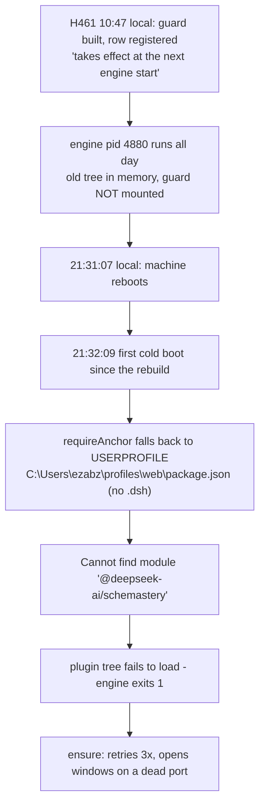

# Incident: DSH engine will not boot — `spend-guard` fails to import (2026-09-17)

**Status: FIXED, 2026-09-17 22:35 local (2026-09-18 02:35 UTC).** The generator now appends the
`.dsh` segment, the cold-boot path has a regression test that fails against the old generator, the
launcher states `DSH_HOME` instead of inheriting it, and `ensure` reports a crash-on-boot with the
exit code and the error lines. See **"Closing addendum"** at the end of this file. `DSH_HOME` at
User scope remains set as a second layer (below).

*Original header, kept for the record: **Status: CONTAINED, root cause OPEN** — the engine was
running again because `DSH_HOME` was set at User scope, and the generator that produced the bad
path had not been fixed. A machine with `DSH_HOME` unset still built an engine that could not boot.
Contained, not fixed.*

This folder is the durable record. `H461` (2026-09-17, 14:47 UTC) is the immediately preceding
handoff and is load-bearing here: it staged the change and named the exact moment it would fire.



---

## What the owner saw

Double-clicking `DSH.lnk` produced, forever:

```
ensure: engine on 3099 is not answering the fast probe - checking patiently
engine on 3099 is not answering (attempt 1/3) - starting it
```

The shortcut was correct: it runs `dshw.ps1 ensure`, then `dshw.ps1 restore`. It was reporting a
real engine failure and retrying, which is what it is built to do.

## What is actually wrong

One path, missing one segment.

`packages/plugin-cost/lib/guard.js` builds the anchor it hands to `createRequire()` as
`DSH_HOME` **else `USERPROFILE`**, then appends `profiles/web/package.json`. When `DSH_HOME` is
unset — and it was unset at **session, User and Machine** scope — the anchor becomes
`C:\Users\ezabz\profiles\web\package.json` instead of `C:\Users\ezabz\.dsh\profiles\web\package.json`.

`guard.js` line 22 requires the bare package `@deepseek-ai/schemastery` **through that anchor**,
so the import fails, the `spend-guard` loader row cannot mount, the whole plugin tree fails to
load, and the engine exits `1`.

Measured, not inferred (`resolution-probe.txt`):

| Anchor handed to `createRequire` | `@deepseek-ai/schemastery` |
|---|---|
| `C:/Users/ezabz/.dsh/profiles/web/package.json` | **RESOLVES** → `...\_npx\1e7f6d9597241db0\node_modules\@deepseek-ai\schemastery\lib\index.cjs` |
| `C:/Users/ezabz/profiles/web/package.json` | **FAILS** `MODULE_NOT_FOUND` |

And the module itself:

| Environment | `import('.../plugin-cost/lib/guard.js')` |
|---|---|
| `DSH_HOME` unset | `FAILED: MODULE_NOT_FOUND` |
| `DSH_HOME=C:\Users\ezabz\.dsh` | `LOADED` |

**The premise in the code comment is false.** `build.mjs` states the anchor "only has to be a real
file" because `createRequire` is "only needed for `node:` builtins, which resolve from any existing
path." But `importBindings()` in the same file also binds **bare package specifiers**, and
`@deepseek-ai/schemastery` is one. The anchor therefore must sit inside the DSH home. H461 records
the same belief — it lists `scripts/build.mjs` as emitting a "**machine-independent require
anchor**". It is machine-independent; it is also wrong whenever `DSH_HOME` is unset.

`USERPROFILE` is not a stand-in for `DSH_HOME`; it is its **parent**. Two other places in this
repo already get the fallback right — `packages/plugin-cost/src/session-log.mjs:23`
(`process.env.DSH_HOME ?? join(homedir(), '.dsh')`) and `multi-window/dshw.ps1:1568`. Only the
generated `requireAnchor()` omits `.dsh`.

## Timeline — why a 10:45 rebuild broke DSH at 21:32

Local = UTC−4.

| Local | UTC | Event |
|---|---|---|
| 10:19:26 | 14:19:26 | Engine `pid 4880` starts and answers — **before** the guard existed |
| 10:22–10:39 | 14:22–14:39 | `src/guard.mjs`, `src/guard-entry.mjs` written; `lib/guard.js` first generated |
| 10:34:12 | 14:34:12 | `cordis.patch.yml` gains the `spend-guard` row |
| 10:45:26 | 14:45:26 | `lib/guard.js` + `lib/index.js` **rebuilt** |
| 10:47 | **14:47** | **H461 filed**: *"The live engine (pid 4880) does NOT have the guard mounted. The bundle row takes effect at the next engine start."* |
| *10:47 → 21:31* | | `pid 4880` keeps running with the **pre-guard tree in memory**. DSH looks perfectly healthy. |
| **21:31:07** | 01:31:07 | **Machine reboots** — this is "the next engine start" H461 was waiting for |
| 21:32:09 | 01:32:09 | First `ensure` after boot → not answering → attempt 1/3 |
| 21:33:17 / 21:34:33 | | attempts continue |
| 21:35:18 | | *"server on port 3099 exited with code 1"* |
| 21:35:22 | | attempt 2/3 — the loop churns, spawning engines that each die |

The junction mount (`~/.dsh/profiles/web/node_modules/dsh-plugin-cost` → the repo checkout) is what
makes a rebuild live with no install step. That is deliberate and documented in
`scripts/install-client-plugins.ps1`. It also means a rebuild **arms** a fault that cannot fire
until the process restarts. Here it stayed armed for eleven hours and detonated on an unrelated
reboot.

H461 did its diligence: 66 unit checks, `verify.mjs` green, `--dump-config` composed the row. But
one line in it was recorded as untested — *"Engine-restart idempotence of day.json was unit-tested,
never exercised on a real restart."* The cold-boot path under an unset `DSH_HOME` was the gap.

## What was tried, and what it actually did

| Step | Action | Measured effect |
|---|---|---|
| 1 | Probed 3099 | A `dsh web` process held the port and never answered — the holder changed between checks (**3760 → 24200 → 9764**), so the retry loop was churning |
| 2 | Read the engine's own stderr log | Named the real cause in one line. **The answer was already on disk.** |
| 3 | Reproduced resolution from both anchors | Proved the `.dsh` segment is the difference |
| 4 | Set `DSH_HOME=C:\Users\ezabz\.dsh` at **User** scope | Persisted in `HKCU\Environment` |
| 5 | Killed the stuck `ensure` loop (pid 16436) and the wedged engine (pid 9764) | Stopped the churn; port freed (only `TIME_WAIT` left) |
| 6 | `dshw.ps1 ensure` with `DSH_HOME` set | **`engine is answering on 3099`** |
| 7 | `dshw.ps1 restore` | **`13 of 13 remembered window(s) reopened`** |

Verification after the fix:

| Check | Result |
|---|---|
| Port 3099 | listening, `pid 4416` |
| `http://127.0.0.1:3099/` | **`401 Unauthorized`** — it answers (previously: timed out). A 401 is health; a timeout was the failure signature |
| Newest engine error logs | `3099-20260917-213930.err.log`, `...213849.err.log` — both **0 bytes** |
| Leftover engines | `0` |
| `dshw status` | `1 engine(s) live`, RSS ~301 MB |

**Deliberately not edited:** `packages/plugin-cost/**`. `git status` shows active uncommitted WIP —
`cordis.patch.yml`, `lib/client.js`, `lib/index.js`, `package.json`, `scripts/build.mjs`,
`test/verify.mjs` modified, plus untracked `lib/guard.js`, `src/guard.mjs`, `src/guard-entry.mjs`,
`test/guard.test.mjs`. That is the very code that broke; editing the generator under a live WIP
would have blurred the mask with the fix.

Rollback of the containment, if ever wanted:

```powershell
[Environment]::SetEnvironmentVariable('DSH_HOME',$null,'User')
```

## Why the launcher could not save itself

`ensure` has a fast probe and a bounded retry, and it used both. It has no concept of *"the engine
started and then crashed."* It only knows the port is not answering. So each attempt booted,
threw during plugin-tree load, and exited `1` — and `ensure` saw the same "not answering" it saw
before. Then `restore` opened windows against a dead port, producing exactly the
`ERR_CONNECTION_REFUSED` that `dshw-launch.cmd`'s own comments say it exists to prevent. The guard
did not fail; it was blind.

The exit code and the stderr tail were **already captured** in `engine-recovery.log`. They were
just not surfaced at the point of failure.

## Files in this folder

| File | What it is |
|---|---|
| `diagnosis-report.md` | The full narrative: identity of the author, timeline, root cause, both layers of defect, what remains open, lessons, appendices. 21 KB. |
| `engine-boot-failure-stderr.log` | **The primary evidence** — the engine's own stderr (5081 bytes) with the `MODULE_NOT_FOUND` stack and `requireStack: C:\Users\ezabz\profiles\web\package.json`. Copied verbatim from `~/.dsh/multi-window/logs/3099-20260917-213523.err.log`. |
| `engine-boot-failure-stdout.log` | Its stdout pair — 0 bytes, which is itself the finding. |
| `resolution-probe.txt` | The `createRequire` resolution measurement and the `guard.js` load measurement, both directions, plus the `DSH_HOME` scope readings before and after. |

## Where things live now

| Thing | Location |
|---|---|
| Containment | `DSH_HOME=C:\Users\ezabz\.dsh`, User scope (`HKCU\Environment`) on ZABZ-YOGA |
| Running engine | `pid 4416` on `127.0.0.1:3099` |
| Preceding handoff | `journal/entries/handoff/H461.md` — the entry that staged this |
| Related record | `docs/mesh/101-spend-guard-installed.md` — the guard's install record and demonstration |
| The unfixed generator | `packages/plugin-cost/scripts/build.mjs`, ~lines 71–82 |
| Bundle keeper | `scripts/install-client-plugins.ps1` (`-Check` reports a broken bundle; D38 is its stated rule) |

## What is still open

1. **The generator.** Fix the fallback in `packages/plugin-cost/scripts/build.mjs` (~lines 71–82) to
   mirror `session-log.mjs`: `process.env.DSH_HOME ?? join(homedir(), '.dsh')`. Then
   `node scripts/build.mjs`, then `scripts/install-client-plugins.ps1 -Check`. **Re-test with
   `DSH_HOME` unset** — a fix that only works with the env var is not a fix. Best done after the WIP
   is committed so the change is reviewable alone. `diagnosis-report.md` Appendix B is the one-line
   regression test.
2. **Elevated inheritance is unproven.** `dshw.ps1` only *reads* `DSH_HOME`; it never sets one. The
   engine depends on inheriting it down `Explorer → cmd → pwsh → node`. The registry value is set and
   the elevation service builds its block from the registry, so it *should* propagate — but proving it
   required killing a healthy engine, which I declined to do mid-session. **If the next cold boot
   fails the same way, that is the tell.** The durable fix is to set `DSH_HOME` inside `dshw.ps1` or
   `dshw-launch.cmd`, removing inheritance from the chain.
3. **`ensure` should read its own crash tail.** It already writes the exit code and stderr tail to
   `engine-recovery.log`; surfacing it at the failure would turn a ten-minute investigation into an
   instant answer.
4. **Unexplained, recorded rather than guessed:** after `restore` reported 13/13, only one window
   group (profile `w4`) remained live within ~90 seconds. **No launcher log records a close or a
   reap**, so the launcher did not close them. It is also worth knowing that `dshw status` run from
   this shell read "1 window open" while 19 Edge processes were present, so that readout
   under-reports in this context.
5. **No journal entry exists for this incident.** `schemastery` appears in no journal entry. Filing
   one needs `journal.py append` (which as of `docs/mesh/108` writes locally only, and whose
   allocator carried a live hazard on 2026-09-17) — **not attempted here.** Intended shape: a `P` for
   the generator defect, an `L` for "a live-reload junction makes uncommitted WIP load-bearing at the
   next restart", and a `W`/`H` linking back to `H461` so the staged change and its detonation stay
   connected.

## Lessons

1. **A live-reload junction makes WIP instantly load-bearing at the *next* restart.** "It works"
   after a rebuild proves nothing until the process restarts. Eleven hours of apparent health proved
   nothing.
2. **`USERPROFILE` is not `DSH_HOME`.** They differ by one segment, and the failure surfaces as
   `MODULE_NOT_FOUND` three layers away from the actual mistake.
3. **A comment asserting a premise is not evidence for it.** The comment said the anchor "only has
   to be a real file"; the code ten lines below required a bare package through that anchor. Reading
   the comment alone would have sent me the wrong way.
4. **Retries without crash-awareness become noise.** Three polite attempts, while the answer — exit
   `1` plus a stack trace — sat in a log nobody had been told to read.
5. **An env var that is unset is a configuration, not an absence.** `DSH_HOME` is documented as an
   *override*, so the default path is the normal path — and the normal path was the broken one.
6. **Masking is legitimate, but only when labelled.** Every document in this folder says the
   containment is not the fix. Otherwise the next reader takes the env var for the repair.

---

*Documented by VS Code Copilot (GitHub Copilot, DeepSeek 4.1 Flash (vision)) on ZABZ-YOGA,
2026-09-17. I have no memory between sessions — this folder, not my recollection, is the record.
Every claim above was verified by a command whose output is quoted or archived here; the two places
where I am reasoning rather than observing are marked as such.*

*(The closing addendum below was added later the same evening by Zabz and does not alter any of the
above.)*

---

# Closing addendum — 2026-09-17 22:35 local (2026-09-18 02:35 UTC)

**Written by: Zabz** (the DSH agent on ZABZ-YOGA), in a session handed this incident as its brief.
Everything above this line is the Copilot session's record and has not been rewritten. This section
records what changed, with the command that shows it. The engine under test throughout was an
isolated one — a scratch `DSH_HOME` under `%TEMP%` on **port 3199** — never `~/.dsh` and never
`pid 4416`, which served the owner's work for the whole session.

## 1. The generator (report §7.1) — the cold boot that died `MODULE_NOT_FOUND`

`packages/plugin-cost/scripts/build.mjs`'s `requireAnchor()` emitted
`(process.env.USERPROFILE || process.env.HOME || '')` **as the DSH home** when `DSH_HOME` was unset —
one segment short. It now appends the separator and `.dsh`, and the false comment above it (the one
asserting the anchor "only has to be a real file") is replaced by the measurement that disproves it.

```
lib/guard.js:  "  const base = process.env.USERPROFILE || process.env.HOME || '';"   <- new
               "    : (base ? base + (base.indexOf('\\\\') >= 0 ? '\\\\' : '/') + '.dsh' : '.dsh');"
old:           "    : (process.env.USERPROFILE || process.env.HOME || '');"           <- gone
```

`node scripts/build.mjs --check` → `ok: lib/index.js`, `ok: lib/guard.js`, `ok: lib/client.js`.
With `DSH_HOME` cleared, Appendix B prints `LOADED` for `lib/guard.js`. The User-scope variable the
Copilot session set is therefore **a belt, not the fix** — and it stays in place, as a second layer.

## 2. The regression test — `packages/plugin-cost/test/cold-boot.test.mjs`

Registered in `test/verify.mjs` as the `coldboot` check, run immediately after `build`. It has two
halves and they catch different things:

| Half | What it does | What it catches |
|---|---|---|
| **STATIC** (10 assertions) | Extracts the emitted `requireAnchor()` from `lib/guard.js` and `lib/index.js`, runs it with `DSH_HOME` cleared, and asserts the anchor contains the `.dsh` segment, ends `.dsh/profiles/web/package.json`, equals this machine's real profile, and that the OLD fallback shape is absent | A generator changed back to a fallback without `.dsh` — **on any machine, including one with no DSH installed**, because the anchor is computed and compared rather than merely loaded. It also catches a hand-edited artifact that has drifted from its generator. |
| **DYNAMIC** (Appendix B verbatim) | `import()`s each generated artifact in a child with `DSH_HOME` deleted from its environment and requires `LOADED` | A bad anchor by its real effect: `MODULE_NOT_FOUND` at load. `lib/guard.js` is the discriminator, because it is the file that requires the bare package `@deepseek-ai/schemastery`; `lib/index.js` needs only `node:` builtins, which resolve from *any* anchor, so its load is a breakage check, not a regression check. |

The dynamic half is skipped **only** when this machine cannot resolve `@deepseek-ai/schemastery`
from the real profile anchor at all — and the skip says so, loudly, with the path it looked at.

**Red, against the old generator.** A copy of the package in `%TEMP%\plugin-cost-oldgen` had its
`requireAnchor()` reverted to the 2026-09-17 shape, was rebuilt, and was tested:

```
=== RED: old generator (scratch copy) ===    9 of 12 checks FAILED, exit 1
  FAIL  lib/guard.js: the unset-DSH_HOME anchor carries the .dsh segment — anchor was C:\Users\ezabz\profiles\web\package.json
  FAIL  lib/guard.js: the old fallback (USERPROFILE with no .dsh) is gone
  FAIL  lib/guard.js: loads with DSH_HOME cleared (the discriminator) — child said: FAILED: MODULE_NOT_FOUND
=== GREEN: this tree ===                     12 checks, 0 failures, exit 0
```

Both halves go red on the static side; the dynamic side is what reproduces the engine's own death
one layer down. `FAILED: MODULE_NOT_FOUND` is the incident's signature, reproduced on demand.

## 3. The launcher (report §7.2) — `DSH_HOME` is stated, not inherited

`multi-window/dshw.ps1` only *read* `DSH_HOME`. It now has one `Initialize-DshHome` helper — the
`$env:USERPROFILE\.dsh` expression that was already in `doctor`, now defined once and used by
`ensure`, by `Start-SlotServer` (the single funnel every launch path passes through: `up`, `restart`,
`new`, `restore`, the watchdog) and by `doctor`. An existing value is never touched, and an ordinary
boot is silent. Measured, real config, `DSH_HOME` cleared in the calling shell:

```
BEFORE  DSH_HOME before ensure = []   ensure: engine is answering on 3099   DSH_HOME after = []
AFTER   DSH_HOME before ensure = []   DSH_HOME was unset - using C:\Users\ezabz\.dsh explicitly,
                                      so the engine does not depend on inheriting it
                                      ensure: engine is answering on 3099   DSH_HOME after = [C:\Users\ezabz\.dsh]
```

and the line lands in `engine-recovery.log`. The inheritance chain Explorer → cmd → elevated pwsh →
node is now irrelevant to whether the engine knows its home.

## 4. `ensure` and crash-on-boot (report §7.3) — the ten minutes

Reproduced end to end in isolation (scratch config, port 3199, `DSH_HOME` pinned to a path that is a
file, so the engine dies with `ENOTDIR` during profile init). Same command, same machine, before and
after:

```
BEFORE  restore  112.8s   3 attempts x 15 lines of stack frames per attempt, no headline anywhere
AFTER   restore   21.2s   1 attempt, and this on the console:

  ensure: the engine on 3199 STARTED AND DIED during boot - it exited with code 1
  ensure:   this is a CRASH ON BOOT, not a dead port: retrying produces the same exit
  ensure:   Error: ENOTDIR: not a directory, mkdir '...\home-as-file\profiles\web'
  ensure:   code: 'ENOTDIR',
  ensure:   errno: -4052,
  ensure:   full stderr: ...\logs\3199-20260917-221905.err.log
```

Three changes, each measured:

1. **The attempt's own log paths are captured before the launch** and passed down. `Get-ServerInvocation`
   stamps its log name with the second, so re-deriving it after a failure can name a file the attempt
   never wrote — which is how the stderr that answers "why did it die" gets missed by the very code
   reading it.
2. **A child that dies is noticed in half a second, not after the whole 180 s budget.** `Wait-ServerReady`
   gained an opt-in `-ExitPid`, used only by the direct-spawn path, which asks the OS the question that
   cannot block (`Process.GetProcessById` throwing `ArgumentException` = definitively gone; any other
   exception is a refusal, so it is ignored). It is deliberately **not** `HasExited` — that is the hang
   recorded in this file twice.
3. **The diagnosis is bounded and it is at the point of failure.** Five lines, chosen: the error
   headline, the code, the first frame in our own code, the `requireStack`. Run against *this
   incident's own stderr*, the digest names everything the Copilot session had to go and find,
   including `requireStack: [ 'C:\Users\ezabz\profiles\web\package.json' ]`:

   ```
   ensure:   Error: dsh: plugin tree failed to load: ... failed to import loader entry spend-guard
             (dsh-plugin-cost/guard): Cannot find module '@deepseek-ai/schemastery'
   ensure:   Error: Cannot find module '@deepseek-ai/schemastery'
   ensure:   at file:///C:/Users/ezabz/code/harness-config/packages/plugin-cost/lib/guard.js:22:16
   ensure:   code: 'MODULE_NOT_FOUND',
   ensure:   requireStack: [ 'C:\\Users\\ezabz\\profiles\\web\\package.json' ]
   ```

   **And it stops after the first one.** A boot that threw and exited is deterministic: attempts 2 and 3
   of the incident (`21:32:09`, `21:33:17`, `21:34:33`) were three copies of one failure. A failure that
   is *not* provably deterministic ("did not report a URL within Ns") still gets its retries.
4. A successful boot gained no new lines: `up` against an isolated, healthy home printed only its normal
   output and started the engine (`state.json` → `startedAt 2026-09-17T22:32:05`, `pid 29984`).

## 5. One unrelated defect found on the way, in the same commit

`test/guard.test.mjs` was **time-of-day dependent** and failing when this session started. The guard
prices a sample at the event's instant, and the flash card doubles every rate for 01:00–04:00 and
06:00–10:00 UTC (Mon–Fri): `usageForUsd(0.015)` is built at the *off-peak* rate, so during UTC peak it
is charged $0.0300 and lands exactly on that section's $0.03 ceiling, and the WARN assertions see
`{kind:'reject'}`. Measured: **red at 01:56Z** (the run that produced this addendum) and **green at
14:47Z** (the run H461 recorded as "verify.mjs green"), with no change to `src/guard.mjs` between them.
Fixed by pinning the clock for that one guard (`deps.now`, a documented `createGuard` dependency —
`src/guard.mjs:227`) to `2026-09-17T12:00Z`, which is off-peak on the card in `pricing.json`. The
assertions were not weakened. `guard: 66/66 checks passed`.

## 6. What is still open, after this

- **Item 4 of the list above** (the unexplained window count after `restore`) is untouched: still
  observed, still unexplained, still not guessed at.
- **Item 5 of the list above** (no journal entry for the incident) is now partly discharged: the
  lesson below is filed. The `P`, `H` and `W` entries the Copilot proposed are not; `H461` still
  carries the staged-change side of the story.
- **`up`/`restart` with `DSH_HOME` unset and a *fresh* home** could not be exercised to completion in
  this session: a fresh scratch home takes ~100 s to resolve its profile, and the harness's own
  console plumbing kept the call open past its budget. What was verified is the launcher's output
  and the engine's start on that path, not the whole run to a clean exit.
- **The `-ExitPid` probe is measured on the direct-spawn path only.** The detached (Task Scheduler)
  path keeps its old behaviour untouched, deliberately, because that is where the `HasExited` hang
  was measured.
- **An elevated cold boot was still not performed.** The launcher no longer depends on inheritance,
  so the reason to perform one has gone — but no one has yet watched the shortcut start the engine
  from a real reboot. The next reboot is the confirmation, and now it would say why if it failed.

## 7. The containment stays

`DSH_HOME=C:\Users\ezabz\.dsh` at User scope (`HKCU\Environment`) remains set on ZABZ-YOGA. It is no
longer load-bearing — the generator is fixed and the launcher states the home itself — but it is a
third layer, and removing it is the owner's call, not this session's:

```powershell
[Environment]::SetEnvironmentVariable('DSH_HOME',$null,'User')   # only if the owner wants it gone
```
